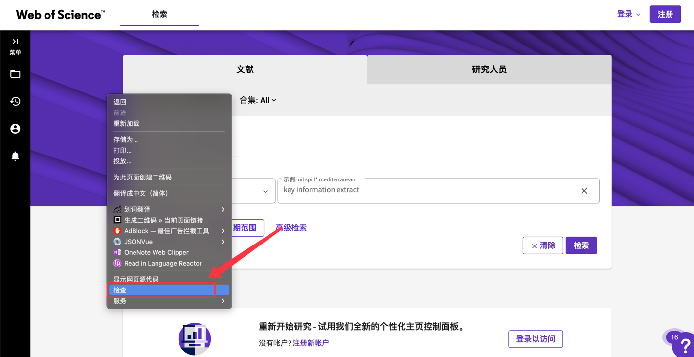
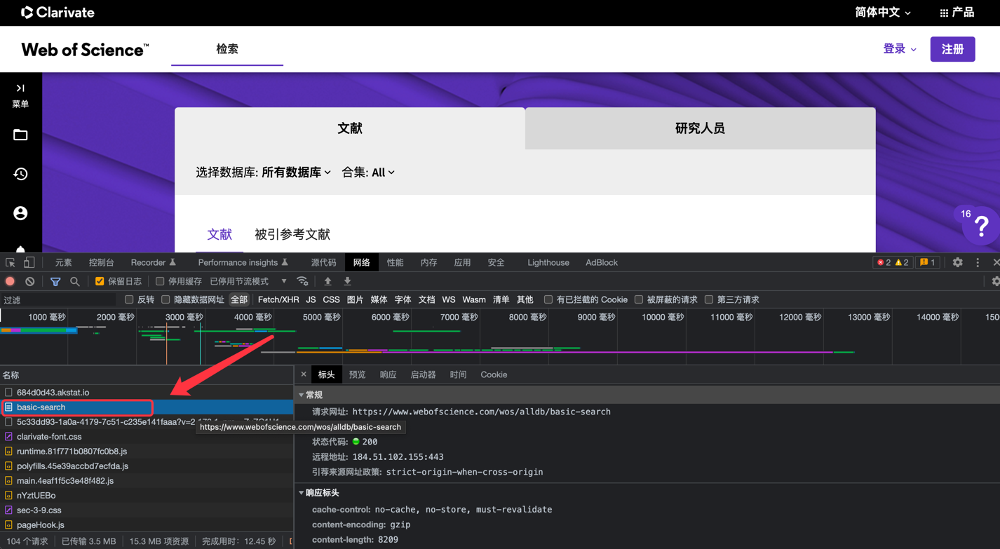
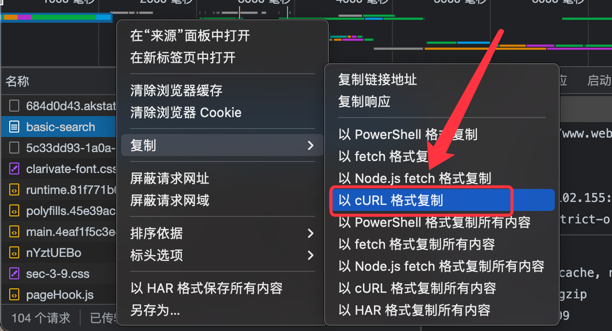
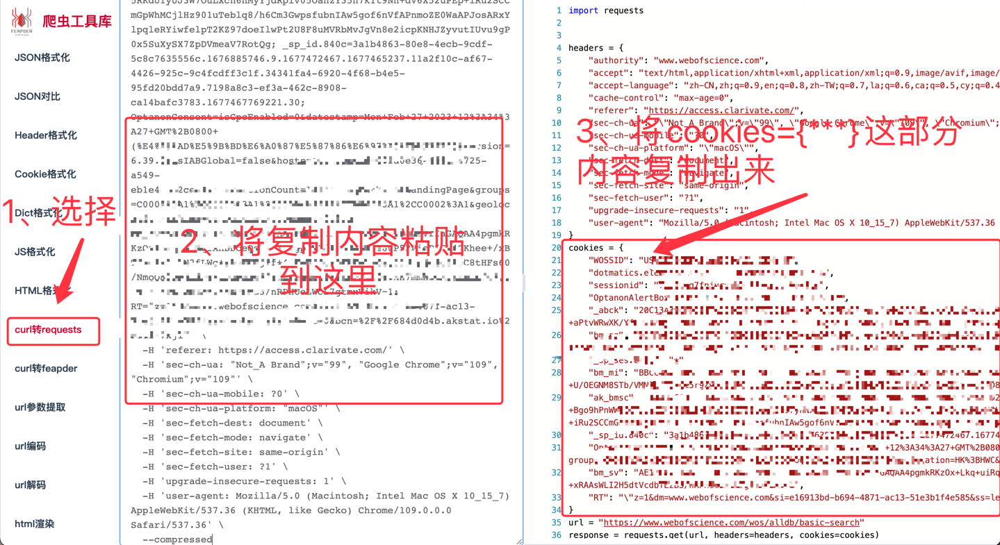

# WOS爬虫

### 一、系统要求
>OS: MacOS / Linux / Windows
### 二、网络要求
>校园网 / 合作机构专用网络
### 三、环境要求
>python 3.10.0
### 四、安装步骤
>pip install -r requirement.txt

### 五、运行流程
- 1、获取替换cookies（详细步骤见六）
- 2、修改keyword，将待搜索的关键字填入
- 3、右键运行
- 4、运行结束后，数据保存在datasets文件夹下，文件命名规则为{key_word}.xlsx

### 六、cookies获取、替换流程
#### 1、打开浏览器，输入:https://www.webofscience.com/wos/alldb/basic-search

### 2、右键检查


### 3、找到"网络"选项，在"网络"选项列表中找到basic-search：


### 4、右键，以cURL格式复制


### 5、打开https://spidertools.cn/#/ 选择curl转requests，然后将复制内容粘贴进去，获取cookies


### 6、将代码中的cookies替换掉


### 注意事项
1、下列代码如果打开注释则程序抓取数据时不会打开浏览器
```python
# chrome_options.add_argument('--headless')
```

2、校园网络不稳定时，会出现加载不出来数据，这个无关代码。

3、抓取速度尽量不要调太快（代码中sleep函数喂了限速），不然会把校园网搞进黑名单。 

4、如果发现自己浏览器可以打开网页，但是代码进不去网页，换一下cookie。
