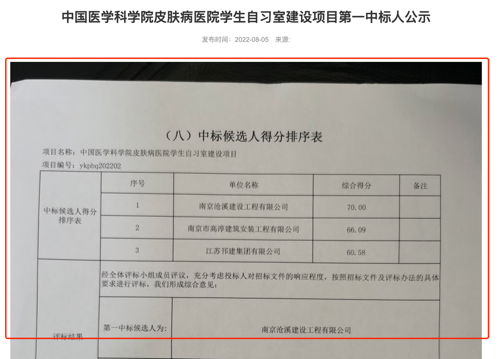
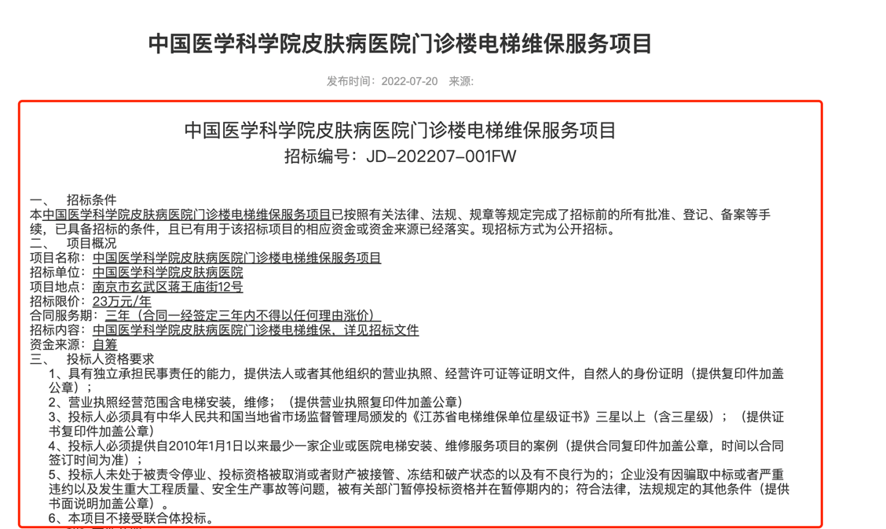
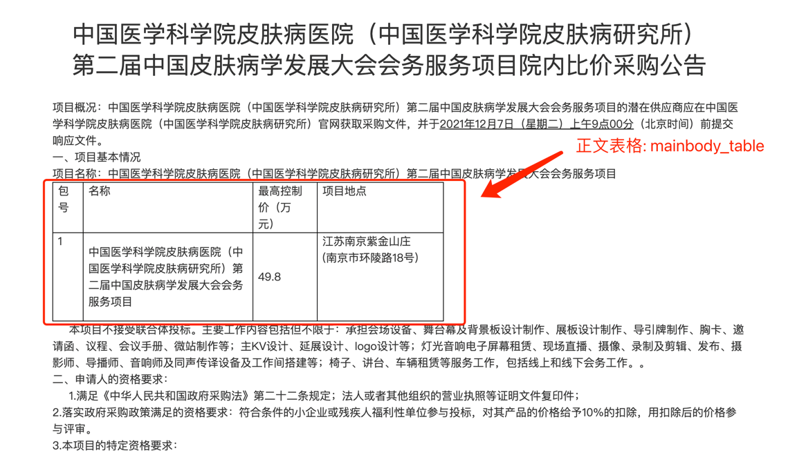
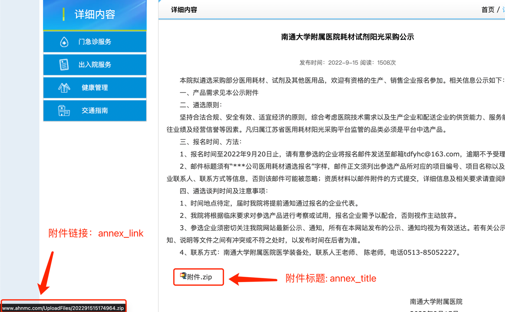
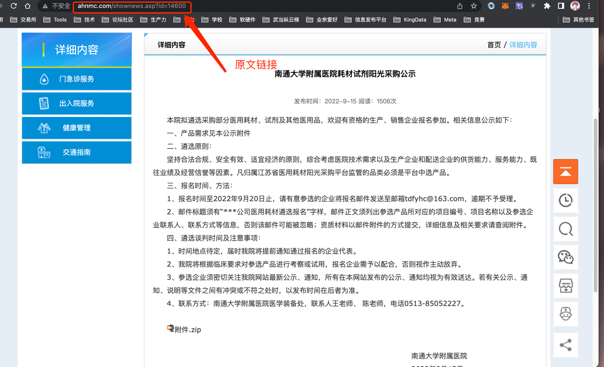
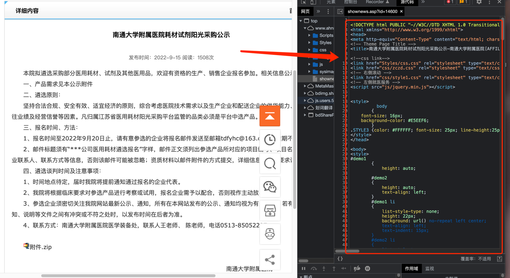

# 医疗爬虫


## 项目介绍
本爬虫包含: 
- 医院招标采购爬虫(/SpiderMan/procurement)
- 医疗保障局通知公告(/SpiderMan/medical)
- 领导人简历(/SpiderMan/redume) 

| 版本     | 更新内容                  | 发布人            |
|--------|-----------------------|----------------|
| 1.0.1  | 增加运行所有爬虫脚本、所有爬虫抓取表格数据 | baochaobajiang |


## 开发环境
> Window、Linux、OSx、Python3.6+

## 部署环境
> Ubuntu、CentOs

## 环境配置
```shell
# 下载python包
pip install -r requirements.txt

# 配置环境变量(根据本机数据库配置)
echo ENVIRONMENT=prod >> .env
echo LOG_LEVEL=WARNING >> .env
echo MONGO_HOST=127.0.0.1 >> .env
echo MONGO_PORT=27017 >> .env
echo MONGO_DB=Spider >> .env
echo MONGO_COLL=treasure >> .env
echo MONGO_USER=admin >> .env
echo MONGO_PSW=123456 >> .env
```

## 测试
> 文件内启动: /SpiderMan/debug.py
> 
> 命令行启动: scrapy crawl [SpiderName]

## 文件介绍
> medical、procurement、resume ———— 爬虫文件
> 
> pipeline、pipelines.py  ———— 管道文件
> 
> utils   ———— 一些杂项，脚手架
> 
> items.py   ———— 用于声明进入管道的数据（暂时未用到）
> 
> middlewares.py   ———— 中间件
> 
> settings.py   ———— 配置文件
> 


## 抓取字段
```
crawl_time # 抓取时间
hospital_name  # 医院名称
title  # 标题
ori_url  # 源文连接
release_date  # 发布时间
annex_link  # 附件链接（正文包含附件时）
annex_title  # 附件标题（正文包含附件时）
img_link  # 图片链接（正文是一张图片时）
img_title  # 图片标题（正文是一张图片时）
mainbody  # 内容主体（正文时文本时）
content  # 正文所在页面的html(带标签)
mainbody_table  # 内容表格（正文时文本时）
others  # 其他
```

## 案例
### ⚠️注意
> 抓取时间由程序自动生成、医院名称编写爬虫时写死在代码里


### 1、标题（同图片标题）、发布时间 & （title、img_titl、release_date）

> 公告标题与发布时间一般出现在列表页

爬取样例:
```text
标题: 中国医学科学院皮肤病医院中央空调维保项目第一中标人公示
发布时间: 2022-08-05
```

### 2、图片链接(img_link)

> 偶尔会出现正文是一张公告的照片的情况，此时需要将图片链接提取出来存下来

爬取样例:
```text
图片链接： http://www.pumcderm.net/upload/images/2022/8/732fcfe72ad343a4.jpg
```

### 3、内容主体(mainbody)

> 公告的详情页内包含公告的主体内容，注意⚠️此处内容主体只包含文字，不带任何html标签

爬取样例:
```text
一、项目名称：南区2层办公室装修改造工程二、成交信息：供应商名称：苏州建鑫建设集团有限公司成交金额：壹拾叁万捌仟柒佰玖拾柒元伍角伍分（￥138797.55）三、标的信息：中标范围与内容：南区2层办公室装修改造四、公告期限：自本公告发布之日起1个工作日。五、联系方式：凡对本次公告内容提出询问，请按以下方式联系：联系人：鲍工电话：0512-62362601&nbsp;苏州市立医院本部2022年9月13日
```

### 4、内容表格(mainbody_table)

> 当公告的详情页出现表格信息时，需要将表格内容存下来，注意⚠️此处的表格️带有html标签

爬取样例:
```html
<table cellspacing="0" cellpadding="0" width="566"><tbody><tr style=";height:25px" class="firstRow"><td width="44" valign="top" style="border: 1px solid windowtext; padding: 0px 7px;" height="25"><p style="line-height:150%"><span style="font-size:   16px;line-height:150%;font-family:黑体">包号</span></p></td><td width="246" valign="top" style="border-top: 1px solid windowtext; border-right: 1px solid windowtext; border-bottom: 1px solid windowtext; border-image: initial; border-left: none; padding: 0px 7px;" height="25"><p style="line-height:150%"><span style="font-size:   16px;line-height:150%;font-family:黑体">名称</span></p></td><td width="93" valign="top" style="border-top: 1px solid windowtext; border-right: 1px solid windowtext; border-bottom: 1px solid windowtext; border-image: initial; border-left: none; padding: 0px 7px;" height="25"><p style="line-height:150%"><span style="font-size:   16px;line-height:150%;font-family:黑体">最高控制价（万元）</span></p></td><td width="183" valign="top" style="border-top: 1px solid windowtext; border-right: 1px solid windowtext; border-bottom: 1px solid windowtext; border-image: initial; border-left: none; padding: 0px 7px;" height="25"><p style="line-height:150%"><span style="font-size:   16px;line-height:150%;font-family:黑体">项目地点</span></p></td></tr><tr style=";height:128px"><td width="44" valign="top" style="border-right: 1px solid windowtext; border-bottom: 1px solid windowtext; border-left: 1px solid windowtext; border-image: initial; border-top: none; padding: 0px 7px;" height="128"><p style="line-height:150%"><span style="font-size:16px;line-height:150%;font-family:黑体">1</span></p></td><td width="246" style="border-top: none; border-left: none; border-bottom: 1px solid windowtext; border-right: 1px solid windowtext; padding: 0px 7px;" height="128"><p style="line-height:150%"><span style="font-size:   16px;line-height:150%;font-family:黑体">中国医学科学院皮肤病医院（中国医学科学院皮肤病研究所）第二届中国皮肤病学发展大会会务服务项目</span></p></td><td width="93" style="border-top: none; border-left: none; border-bottom: 1px solid windowtext; border-right: 1px solid windowtext; padding: 0px 7px;" height="128"><p style="line-height:150%"><span style="font-size:16px;line-height:150%;font-family:黑体">49.8</span></p></td><td width="183" valign="top" style="border-top: none; border-left: none; border-bottom: 1px solid windowtext; border-right: 1px solid windowtext; padding: 0px 7px;" height="128"><p style="line-height:150%"><span style="font-size:   16px;line-height:150%;font-family:黑体">江苏南京紫金山庄</span></p><p style="line-height:150%"><span style="font-size:16px;line-height:150%;font-family:黑体">(</span><span style="font-size:16px;line-height:150%;font-family:黑体">南京市环陵路18号)</span></p></td></tr></tbody></table>
```

### 5、附件标题、链接(annex_title、annex_link)

> 当公告的详情页含有附件内容时，存下链接及附件名称

爬取样例:
```text
附件标题：附件.zpi
附件链接：http://www.ahnmc.com/UploadFiles/202291515174964.zip
```

### 6、源文连接(ori_url)

> 公告详情页的链接，一般出现在列表页(见案例1)

爬取样例:
```text
http://smh.cc/api2020/api/news/getNewsInfo?hospital=1010&category=32&tag=&size=8&pageNum=1&type=0&status=1&_=1657282609378id=7700
```

### 7、正文h5(content)

> 带有html标签的正文内容

爬取样例:
```html
<!DOCTYPE html>
<html lang="en">
<head>
    <meta http-equiv="Content-Type" content="text/html; charset=utf-8" />
    <meta http-equiv="X-UA-Compatible" content="IE=edge,chrome=1">
    <title>常州市政府采购网</title>
    <link href="/images/2019/style.css" rel="stylesheet" type="text/css" />
    <script type="text/javascript" src="/images/2019/jquery.min.js"></script>
    <script type="text/javascript" src="/images/2019/lunhuan.js"></script>
    <style type="text/css">
        #czfxfontzoom table {
            border-spacing:0px;
            border-collapse: collapse;
        }
        #czfxfontzoom table td {
            /*text-align: center;border: 1px;*/
        }
    </style>
<!--常备js包22-10-13 18:36:05 powered by 常州风讯 www.czfx.cn-->
<script language="javascript" src="http://zfcg.changzhou.gov.cn/js/common.js"></script>
</head>
<body style="position:relative;">

<div style="height: 230px;background: url(/images/2019/logo.png) no-repeat center center;overflow: hidden"></div>
<div style="height: 50px;background: url(/images/2019/nav_bg.png) repeat-x;"></div>
<table width="100%" border="0" cellspacing="0" cellpadding="0" align="center" style="position: absolute;top:200px;">
    <tr>
        <!--导航-->
        <td valign="top" height="50">
            <table width="1200" border="0" cellspacing="0" cellpadding="0" id="nav" align="center" style="background-color: #1479c8;">
                <tr>
                    <td height="50" align="center" class="menu"><a href="/">网站首页</a></td>
                    <td height="50" align="center" class="menu"><a href="/ns_class/bszn">办事指南</a></td>
                    <td height="50" align="center" class="menu"><a href="/ns_class/zcfg">政策法规</a></td>
                    <td height="50" align="center" class="menu"><a href="/ns_class/class_cgxx">采购信息</a></td>
                    <td height="50" align="center" class="menu"><a href="/ns_class/jgcf">监督信息</a></td>
                    <td height="50" align="center" class="menu"><a href="http://www.ccgp-jiangsu.gov.cn/zjzc/login" target="_blank">专家管理</a></td>
                    <td height="50" align="center" class="menu"><a href="/ns_class/zfcgml">政府采购目录</a></td>
                    <td height="50" align="center" class="menu"><a href="/ns_class/gqwtcg">国企委托采购</a></td>
                    <td height="50" align="center" class="menu"><a href="/ns_class/down">下载中心</a></td>
                    <td height="50" align="center" class="menu"><a href="http://czj.changzhou.gov.cn/class/OQEHOLAA" target="_blank">来信咨询</a></td>
                </tr>
            </table>
        </td>
    </tr>
    <tr>
        <!--搜索-->
        <td valign="top">
            <table width="1200" border="0" cellspacing="0" cellpadding="0" align="center">
                <tr>
                    <td height="40" style="background: url(/images/2019/search_bg.png) repeat-x;line-height: 40px;">
                        <table width="1200" border="0" cellspacing="0" cellpadding="0">
                            <tr>
                                <td align="left" style="padding-left: 15px;">今天是：<script type="text/javascript" language="javascript" src="/images/2019/today.js"></script></td>
                                <td align="right" style="padding-right: 15px;">
                                    <form id="form_search" action="http://search.changzhou.gov.cn/index.php" method="get" target="_blank">
                                         <input type="hidden" name="sitename" value="zfcg" />
                                        <div style="position: relative;">
                                                <label>全文搜索：</label>
                                                <input id="search" name="keyword" type="text" placeholder="请输入关键词" value="" />
                                                <input id="searchImg" type="button" onclick="$('#form_search').submit();">
                                        </div>
                                    </form>
                                </td>
                            </tr>
                        </table>
                    </td>
                </tr>
            </table>
        </td>
    </tr>
    <tr><td height="20"></td></tr>
</table>
<table width="100%" border="0" cellspacing="0" cellpadding="0" align="center" style="margin-top:30px;">
    <tr>
        <!--正文-->
        <td valign="top" height="400">
            <table width="1200" border="0" cellspacing="0" cellpadding="0" align="center" style="border:1px solid #f0f0f0">
                <tr>
                    <td width="1200" valign="top" height="50" class="lm_tab" style="">
                        <table width="100%" border="0" cellspacing="0" cellpadding="0" align="center">
                            <tr>
                                <td align="left">您当前的位置：<a href="http://zfcg.changzhou.gov.cn/">首页</a> >> <a href="/ns_class/class_cgxx">采购信息</a> >> <a href="/ns_class/class_fscg">分散采购</a> >> <a href="/ns_class/class_fscg_cjgg">成交公告</a> >> <a href="/ns_class/dlcg_cjgg">成交公告</a> >> 正文</td>
                            </tr>
                        </table>
                    </td>
                </tr>
                <tr>
                    <td style="padding-top: 25px;">
                        <table width="94%" border="0" cellspacing="0" cellpadding="0" align="center">
                            <tr><td align="center" class="news_tit">常州市肿瘤医院医用液氧供应成交结果公告</td></tr>
                            <tr><td align="center" style="border-top:1px solid #CCC; font-size:13px;height: 30px;line-height: 30px;">发布日期：2022-10-13&nbsp;&nbsp;浏览数：<script language="javascript" src="/hits.php?Action=ns_news&fid=966633"></script>&nbsp;&nbsp;字号：〖<a href="javascript:czfxfontzoom(16)"><span style="color:#666666">大</span></a> <a href="javascript:czfxfontzoom(14)"> <span style="color:#666666">中</span></a> <a href="javascript:czfxfontzoom(12)"><span style="color:#666666">小</span></a>〗</td></tr>
                            <tr><td height="30"></td></tr>
                            <tr><td height="300" valign="top" id="czfxfontzoom"><p>
	&nbsp;&nbsp;&nbsp;&nbsp;<!--StartFragment-->
</p>
<div>
	&nbsp;&nbsp;&nbsp;&nbsp;
	<p>
		成交结果公告
	</p>
	<p>
		一、项目编号：正衡采竞磋[2022]067-1号
	</p>
	<p>
		二、项目名称：常州市肿瘤医院医用液氧供应
	</p>
	<p>
		三、成交信息：
	</p>
	<p>
		&nbsp;&nbsp;供应商名称：常州市长宇实用气体有限公司
	</p>
	<p>
		&nbsp;&nbsp;供应商统一社会信用代码：91320411666374682K
	</p>
	<p>
		&nbsp;&nbsp;供应商地址：常州新北区春江镇巴黎路
	</p>
	<p>
		成交金额（单价）：壹仟壹佰元整/吨（¥1100.00元/吨）
	</p>
	<p>
		四、主要标的信息：
	</p>
	<table border="1">
		<tbody>
			<tr>
				<td>
					<p>
						货物类
					</p>
				</td>
			</tr>
			<tr>
				<td>
					<p>
						名称：常州市肿瘤医院医用液氧供应
					</p>
					<p>
						品&nbsp;牌（如有）：详见附件
					</p>
					<p>
						规格型号：详见附件
					</p>
					<p>
						数量：预计使用量/年:330吨
					</p>
					<p>
						单价：1100元/吨
					</p>
				</td>
			</tr>
		</tbody>
	</table>
	<p>
		五、评审专家名单：
	</p>
	<p>
		钱建东、毕承路、袁建昌
	</p>
	<p>
		六、采购代理服务费收费标准及金额：
	</p>
	<p>
		&nbsp;&nbsp;以成交金额为基数，按照成交金额的9‰收取。本项目代理服务费人民币3267.00元，由成交单位在领取成交通知书时支付。
	</p>
	<p>
		七、公告期限：
	</p>
	<p>
		&nbsp;&nbsp;自本公告发布之日起一个工作日<br />
八、其他补充事宜：无
	</p>
	<p>
		九、凡对本次公告内容提出询问，请按以下方式联系
	</p>
	<p>
		1、采购人信息：
	</p>
	<p>
		名称：常州市肿瘤医院&nbsp;
	</p>
	<p>
		地址：常州市红河路68号
	</p>
	<p>
		联系人：刘女士
	</p>
	<p>
		电　话：69807043
	</p>
	<p>
		2、采购代理机构：
	</p>
	<p>
		名称：常州正衡招投标有限公司
	</p>
	<p>
		地址：常州市新北区新城府翰苑6栋9楼
	</p>
	<p>
		联系电话：0519-85576566
	</p>
	<p>
		3、项目联系方式：
	</p>
	<p>
		项目联系人：孙阳
	</p>
	<p>
		联系电话：0519-85576566
	</p>
	<p>
		十、附件：
	</p>
	<p>
		1.正衡采竞磋[2022]067-1号采购文件
	</p>
	<p>
		2.正衡采竞磋[2022]067-1号残疾人福利性单位声明函
	</p>
	<p>
		&nbsp;
	</p>
	<p>
		&nbsp;
	</p>
	<p>
		&nbsp;
	</p>
	<p>
		&nbsp;
	</p>
</div>
<p>
	&nbsp;&nbsp;&nbsp;&nbsp;<!--EndFragment--><!--file_sep_start--><br />
附件：<br />
<a href="/upfiles/fromtuisong/20221013/20221013142006_182.pdf">正衡采竞磋[2022]067-1号 常州市肿瘤医院医用液氧供应项目.pdf</a><br />
<a href="/upfiles/fromtuisong/20221013/20221013142006_6931.jpg">主要标的信息.JPG</a><br />
<a href="/upfiles/fromtuisong/20221013/20221013142007_1786.pdf">正衡采竞磋[2022]067-1号残疾人福利性单位声明函.pdf</a><!--file_sep_end-->
</p></td></tr>
                            <tr><td height="40px;"></td></tr>
                        </table>
                    </td>
                </tr>

            </table>
        </td>
    </tr>
    <tr><td height="30"></td></tr>
</table>
<table width="100%" border="0" cellspacing="0" cellpadding="0" align="center" style="">
<tr>
        <!--底部-->
        <td valign="top">
            <table width="1200" border="0" cellspacing="0" cellpadding="0" align="center" id="footer">
                <tr>
                    <td height="10" style="background: url(/images/2019/footer_bg.png) repeat-x;"></td>
                </tr>
                <tr>
                    <td align="center">Copyright (C) 2009-2010 by 常州市财政局 版权所有 网站统计</td>
                </tr>
                <tr>
                    <td align="center">主办单位：常州市财政局 联系信箱：czj@czfb.gov.cn</td>
                </tr>
                <tr>
                    <td align="center">技术支持：常州风讯网络科技有限公司 建议使用1024*768分辨率浏览 页面执行0.72023秒</td>
                </tr>
                <tr>
                    <td align="center">政府网站标识码：3204000012   ICP备案号：苏ICP备05003616号   公安机关备案号：苏公网安备32041102000483号</td>
                </tr>
                <tr>
                    <td align="center"><a href="http://121.43.68.40/exposure/jiucuo.html?site_code=3204000012&url=http%3A%2F%2Fzfcg.changzhou.gov.cn" target="_blank"></a></td>
                </tr>
            </table>
        </td>
    </tr>
</table>

</body>
<script language="javascript">
    // 设置字体大小
    function czfxfontzoom(size){
        document.getElementById('czfxfontzoom').style.fontSize=size+'px';
    }
    // 图片自动缩放，适应页面宽度
    function changeImageSize(){
        var image_list=document.getElementById('czfxfontzoom').getElementsByTagName("IMG");
        var imagewidth=900;		//设置图片最大宽度
        for(i=0;i<image_list.length;i++){
            imageobj = image_list[i];
            if(imageobj.width>imagewidth){
                image_rate = imageobj.height / imageobj.width ;
                sString="";
                imageobj.outerHTML=sString;
            }
        }
    }
    setTimeout('changeImageSize()',1000);

</script>
</html>

```